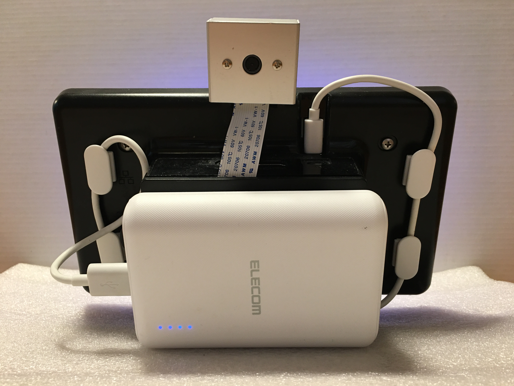

# 数独システム

数独問題の作成や、自動回答を行うシステムです。

デバイス前面            | デバイス裏面
:-------------------:|:---------------------:
 | 

## このシステムで出来ること

数独問題の作成:

- 数独問題を雑誌や新聞からカメラで取り込む
- 数独問題を画面から入力する

数独問題を解く:

- 自動で問題を解く
- 問題のヒントを出す

## インストール手順

数独システムを動かすために必要なライブラリのインストール手順です。Raspberry Pi 3B+の使用を前提としています。

### 必要なライブラリのインストール

はじめに、パッケージマネージャを更新します。

```shell
sudo apt-get update
```

OCR用のソフトウェアをインストールします。

```shell
sudo apt-get -y install tesseract
```

OpenCVの依存ライブラリをインストールします。

```shell
sudo apt install -y libpango-1.0-0 libpangocairo-1.0-0 libatk1.0-0 
sudo apt install -y libcairo-gobject2 lib$
sudo apt install -y libwebp6 libtiff5 libjasper1 libgdk-pixbuf2.0-0
sudo apt install -y libopenexr23 libilmb$
sudo apt install -y libavutil56 libavcodec58 libavformat58 libswscale5
sudo apt install -y libgtk-3-0 libgst$
sudo apt install -y libqtcore4 libqtgui4 libqt4-test
```

### 必要なPythonモジュールのインストール

pipのインストールを行います。

```shell
sudo apt install -y python3-distutils
curl https://bootstrap.pypa.io/get-pip.py -o get-pip.py
sudo python3 get-pip.py
```

依存するPythonモジュールをインストールします。

```shell
pip3 install opencv-python==3.4.6.27 -i https://piwheels.org/simple
pip3 install numpy -i https://www.piwheels.org/simple
pip3 install  flask pyocr
```

## 数独システムの起動

`git clone`コマンドで数独システムをダウンロードします。

```shell
git clone https://github.com/Hiroshi-Maeda-Donau/Donauhiro.git
cd Donauhiro/
```

数独システムを起動します。

```shell
python3 server.py
```

サーバーが立ち上がったら、ブラウザのURL欄にRaspberry PiのIPアドレス（または、ホストネーム）を入力してアプリケーションを開きます。

## 詳細情報

装置の組み立て方や数独システムの使い方など、詳しい情報はこちらを確認してください。

- [装置のセットアップ](./docs/setup.md)
- [システムの使い方](./docs/usage.md)
- [自動起動の設定](./docs/automation.md)
- [開発情報](./docs/development.md)
- [数独システムのアルゴリズム](./docs/algorithm.docx)

## その他

- 本システムはデアゴスティーニの*もっと本気で学ぶIOT*講座で提供されたデバイス、ソフトウェアをベースに私が開発したものです。
- コードについては講座で提供されたものを私が改造したもの、ネットから入手したものを私が改造したもの、私が独自に開発したものが混在しています。
- カメラで撮影した画像の読み取りはまだ完璧ではなく、下記のような問題があります。
    1. 明るい照明の元でないと数独問題の画像読み取りに失敗する場合が多い（もう一度撮影して下さい、というメッセージが出ます）。
    2. 読み取り成功してもデジタル化の成功率が低い（現在70%ぐらいです。間違えたマスは手入力で修正する必要があります）。
- 本システムはPC自体に移植することはそれほど難しくないと思いますが、私はやっていません。LCDパネルなどの投資が必要ないので自信のある方はお試しください。

## 開発者

- Donauhiro
