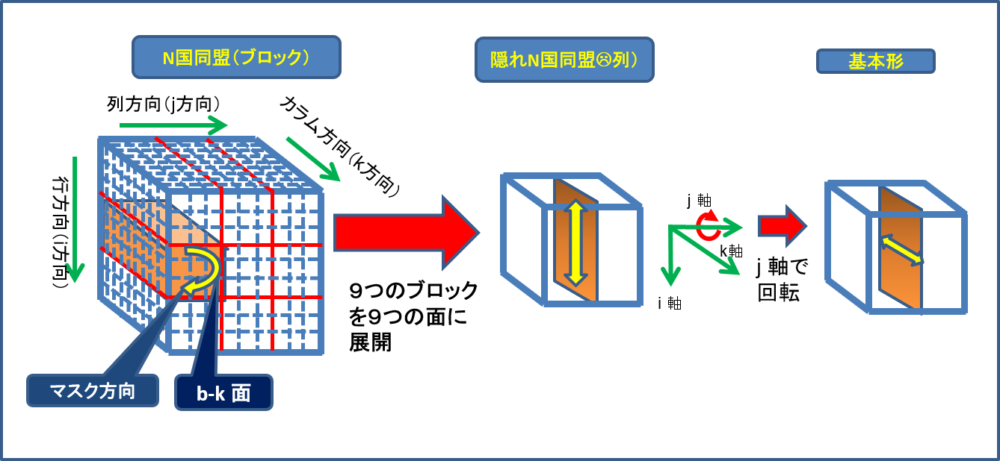

# 数独システムのアルゴリズム

## ＊はじめに

数独はパズルなので、自分の頭で解いて楽しむものです。
コンピュータに解いてもらっても全然楽しくありません。
本システムは数独問題を解くコードを持っていますが、このコードを利用して下記のものを提供するのが目的です。  
(1) 新しい数独問題を作り出す  
(2) 既存の問題に対して解くヒントを出す
(3) 自分で解いた答えを確認する  

以下の説明は、一般的な数独の解法を、どのようなアルゴリズムでコード化しているのかを説明しています。

## 1. 言葉の定義

<三次元化>  
数独システムのコードでは数独問題をまず三次元化して考えます。  
（Fig.A  三次元化の概念）

図のように数独問題は9×9×9個=729個の箱からなる三次元立体に変換する事が出来ます。
例えば、左上のマスが"5"だとすると、三次元化すると、カラム方向の５番目の箱が”真”ということになります。（"真"の意味については後述）

<ノード>  
三次元化した立体（キューブ）にはi-j面、i-k面、j-k面、b-k面の四つの面があることになります。
四つの面はそれぞれ９面ずつありますから、全部で３６面あることになります。
b-k面は３×３の平面が9個ありますので、９×９にひきのばして考えるとわかりやすいです。
ほとんどの数独問題はこの四つの面の中で解法を考える事が出来ます。
この立方体には9×9×9個=729個の箱があると言いましたが、私はそれぞれの箱を
"ノード"と呼んでいます。

<ノードの状態>  
この箱の中身には三種類の状態が存在します。"真：True"の玉が入った箱,"偽：False"の玉が入った箱,"空：Vacant"つまり何も入っていない箱です。
一つの箱に"真"が入ると、数独のルールにより、i-j面、i-k面、j-k面、ブロック面の全てで、この"真"の箱に影響される箱に"偽"が入ります。
同じピア（次項）内には”真”の玉はひとつしか入らないからです。

<ピア>  
一つの"真"に影響される９つの箱のグループを私はピアと呼んでいます。Fig.Bのように、一つの”真”の箱（ノード）には４つのピアが連動しています。

（Fig.B ピア）

便宜上、i方向のピアを"列ピア"、j方向のピアを"行ピア"、ブロック方向のピアを"ブロックピア"、k方向のピアを"カラムピア"と呼ぶことにします。  
数独問題では通常9×9=81個のマスの内、２０数個から３０個のマスに数字が入っています。Fig.Bでは二次元で言うと５行目1列目に９が入った状態をあらわしています。
するとこのノードに関連する４つのピアの箱の全てに"偽"の玉が入ることになります。
言い換えると、最終的に各ピアには必ず一つの"真"の箱と、８つの"偽"の箱ができることになります。

ちょっと話がそれますが、数独で使用されている1~9の数字は数字としてではなく単に記号として使われているだけです。
ですから、１?９の代わりにa?iを使っても構わないわけです。

<マスク>  
"偽"の玉が箱（ノード）に入った状態のことを、マスクがかかっていると言います。
その箱には二度と"真"の玉が入ることはないからです。
各箱（ノード）に"真"が入るか"偽"が入るかを決めるのが数独問題を解く作業ということになります。

<コア>  
上に述べたことを逆に言うと、あるピアで８つの箱に“偽”の玉がはいることによって、残りのノード（箱）には"真"の玉しか入りません。その"真"のノードにつながる残り３つのピア内の残り２４個の箱は全て"偽"の玉が入り、マスクがかかった状態になります。  
しかし、あるノードが"真"である事が確定出来なくても、ある範囲のノードのどれかが"真"であるとわかれば、
その範囲のノード以外に、同じピア内にある空ノードに"偽"の玉を入れる（マスクする）事が出来ます。  
この"ある範囲のノード"のことを"コア"と呼ぶことにします。  
この説明だけではわかりにくいと思いますので、以降のセクションで実例を見ながら説明します。

## 2.数独の解法と三次元キューブとの関係

(1) 単独未確定  
何度も言いますが、あるピアの９つのノード（箱）に"偽"の玉が８つ既に入っている場合、残りの一つの箱には必ず"真"が入って、元の9×9の二次元の問題に置き換えると、一つのマスの数字が確定します。すると、この”真”のノードに連動する残り三つのピアの全ノードにも”偽”の玉が入ることになります。ほとんどの数独問題はマスクノード(“偽”の玉が入っているノード)を増やしていって最終的に単独未確定の形に持っていって数字を決めていくという手順になります。
まれに違う方法が必要になる時もありますが。

(2) 座席予約  
単独未確定法で決まる数字が見つからなくなった時、次に易しいのがこの方法です。
前に説明した"コア"を見つける方法の一つです。

(Fig.C 座席予約)

i-j面で考える解法です（ある一つの数字で考えるということになります）。  
ブロックと行、またはブロックと列で、必ず重なるノードが三つありますが、この三つの重なるノードがコアになる可能性があります。（Fig.Cで緑のノード）  
例えば、この重なっている三つのノードが２か3個"空"（未確定）であるとします。  
同じ行または列内の他のノードは全て"偽"だとすると、"真"の玉はこの２から３個のノードのどれかに必ず入ることになります。　　
すると、この"コアノード"と同じブロックピアにある空（未確定）ノードには"偽"の玉が入ることになります。（Fig.Cで「列・行→ブロック」と表示）
この緑のノードのグループ（コア）を座席予約されていると表現します。

ブロックと行、ブロックと列を入れ替えて考えても同じ理屈が成立します。  
つまり、あるブロックピア内で、ブロックピアと重なる三つのノード以外に空（未確定）ノードが存在しない時(座席予約されている)、この三つのノードと同じ行ピアまたは列ピア内の未確定ノードは全て"偽"の玉が入ります。（Fig.Cで「ブロック→列・行」と表示）

(3) N国同盟と隠れN国同盟  

(Fig.D 二国同盟と隠れ二国同盟)

i-k面、またはj-k面、またはブロック-k面で考える解法です。N個の数字に着目します。  
Nは２から８まで可能性がありますが、考え方は同じですので、N=2（二国同盟）で説明します。  
図のように四つの空ノード（緑）が配置されているとします。ノードa,b,c,d は必ず四角形に配置されています。
四本のピアが井桁状に重なっているわけです。ブロック麺は9X9に展開して考えてください。  

<二国同盟の場合>  
横二本のピア（青）で考えると、a,b,c,d以外に空ノードがないわけですから、ノードa が"真"ならノードd が"真"、ノードb が"真"ならノードc が"真"であるという論理が成立します。一つのピアには一つの"真"の玉しか入らないというルールを思い出して下さい。
この４つのノード以外には"真"が入らないということになり、ノードa~d が"コア"ということになります。
するとノードc,dと同じピアにあるノードe は"偽"ということになります。
通常これは"二国同盟"と呼ばれる解法になります。

<隠れ二国同盟の場合>  
逆にコアから見てタテ方向にマスクが発生する場合は”隠れ二国同盟”ということになります。（Fig.Dの下のほう）

(Fig.E 三国同盟の場合)

Nが３以上の場合も考え方は二国同盟または隠れ二国同盟と同じです。ただ必ずしもコアノードの数がN×Nでなくても、Fig.Eの右側の図のように赤丸の部分が“空”でなく“偽”が入っていてもかまいません。”真”がN個配置できるような形であればよいということです。

数独システムのソースコードの中ではN国同盟も隠れN国同盟も四辺形の定理（行、列）も同じ関数を使っています。
基本の関数はi-k面での隠れN国同盟で作って、その他の面での隠れを含むN国同盟のコアを探すときは三次元キューブを回転してi-k面の隠れN国同盟になるようにし、コアが見つかってから三次元キューブを元に戻すという手法を使っています。

<三次元キューブの回転と各解法の関係>

(Fig.F-1 隠れN国同盟（列）（基本形）)

数独システムではFig.F-1のように基本形を隠れN国同盟（列）を基本形としています。
例えばFig.F−2のように、”N国同盟(列)”を基本形の”隠れN国同盟(列)”に変換するにはｊ軸で90度回転すれば良いことになります。

(Fig.F-2 N国同盟（列）-->基本形)

その他のケースは下記の通りです。

(Fig.F-3　隠れN国同盟（行）　--> 基本形)

N国同盟（行）を基本形にするには、まずk軸で回転してN国同盟(列)にする必要があります。

(Fig.F-4 N国同盟（行）--> 基本形)

(Fig.F-5 隠れN国同盟（ブロック） --> 基本形)

３×３の９つのブロックを１×９の面に展開します。水平に展開してもさしつかえありませんが、基本形にするにはFig.F-2のように回転が必要になります。
面の順番はどうやっても構いません。

(Fig.F-6 N国同盟(ブロック) --> 基本形)

N国同盟（ブロック）を基本形にするには、ブロックを面に展開した後J 軸で回転する必要があります。

(4) 四辺形の定理（行と列）
Fig.F-6のように三次元キューブを回転させると上記の各N国同盟、隠れ二国同盟と同じ解法になります。

Fig.F-7 四辺形の定理（行、列）

四辺形の定理もN×Nのコアによる解法で説明できます。
Nが３のときは”ソードフィッシュ”、４以上になると”ホエール”とか”リバイアサン”とか呼ばれることがあります。コアの形から来ていると思いますが、よくわかりません。いずれも海洋生物の名前です。リバイアサンは海に住む空想上の怪物ですね。

(5) 強ループ法と弱ループ法  

Fig.G 強ループと弱ループ

今までの解法は三次元キューブに存在する３６面の内、一つだけを使う解法でした。
強ループ法と弱ループ法は複数の面にまたがる解法になります。  
図でマル（○ ）は一つの空ノード、二本線（＝）は両端のノードが強リンクであるということを、一本線（ー）は両端のノードが弱リンクであるということを表しています。
当然、二本線または一本線の両端のノードは同じピアにあリます。

強リンクとは、一方のノードが"真"だと、他方のノードは"偽"になり、一方のノードが"偽"だと他方のノードは"真"になるという関係のことです。言い換えると、この二つのノードがあるピアには他に空ノードが無いということです。

弱リンクは逆に一本線の両側のノード以外に空ノードが同じピア内にあるということです。
つまり、一方のノードが"真"だと他方のノードは"偽"になりますが、一方のノードが"偽"のとき、他方のノードは必ずしも"真"にはならないということです。具体的には同じピア内に空ノードが三つ以上あるケースです。

私はX0のノードをターゲットノードと呼んでいます。
このターゲットノードの両端が強リンクになっているループを強ループ、両端が弱リンクになっているループを弱ループと呼んでいます。
このターゲットノードにつながる二つのノード以降は強リンクと弱リンクが交互に現れています。
なお弱リンクは強リンクと置き換え可能ですが、強リンクの代わりに弱リンクを持ってくることはできません。
強ループのターゲットノードは必ず”真”になり、数字が確定できます。
弱ループのターゲットノードは必ず”偽”になります。数字の確定はできませんが、マスクノードとすることができます。
この理屈は以降で説明します。そういうものだと思ってもらえる方は読み飛ばしてください。

<強ループの性質>  

Fig.H 強ループの例

Fig.Hの例では連動するピアがP1からP7ばであり、ピアの交差するノードが強ループを形成しています。”真”となるノードを”1”､他のノード（“偽”）を”0”に置き換えて考えると、数独のルールから一つのピアの合計は必ず”1”になります。
するとFig.Hの場合、下記の式が成り立ちます。

P1　 a + b　　　　　　　　　　　　　= 1  
P2　　　b + c + d　　　　　　　　　　= 1  
P3 　　　　　　d + e　　　　　　　　= 1  
P4　　　　　　　　e + f + g　　　　　= 1  
P5　　　　　　　　　　　g + h　　　　= 1  
P6　　　　　　　　　　　　　h + i + j　= 1  
P7　a　　　　　　　　　　　　　　+ j　= 1  
'-------------------------------------  
合計   2a +2b +c +2d +2e + f+2g+2h + i + 2j  	= 7  
　　　　　↓   
　　2(a+b+d+e+g+h+j)+c+f+i = 7  

ここで、a+b=1,d+e=1,g+h=1は確定していますから、この式は下記のようになります。  
　　　2 ( 3 + j ) + e + f + i = 7  
そうすると、もしj が”1”なら2(3+j)だけで8 になってしまい、合計を 7 にすることができなくなってしまいます。したがって、j は”0”でなくてはならず、P7の式から a は”1”（真）という理論が成り立ちます。また上の式の右辺を７にするには、e,f,iのどれか一つは必ず”1”である必要があります。この点は今のところ重要ではありませんが、数独問題を解くヒントになることがあるかもしれません。

以上のことは下記のように考えてもOKです。  
ノードaが"偽"と仮定すると、  
	↓  
ノードbは"真"  
	↓  
ノードcと d は"偽"  
	↓  
ノードeは"真"  
	↓  
ノードfと g は"偽"  
	↓  
ノードhは"真"  
	↓  
ノードiと j は"偽"  
	↓  
ノード a は”真”  
となり、最初の仮定であるノード a は”偽”という仮定が間違っていることになり、ノードaは"真"ということになります。

<弱ループの性質>

Fig.H 弱ループの例

弱ループの場合も下記のように同じやり方でターゲットノードが”偽”であることが証明できます。

P1　a + b + c				= 1  
P2　　　　c + d				= 1  
P3 　　　　　d + e + f			= 1  
P4　　　　　　　　 f + g			= 1  
P5　　　　　　　　　　g + h + i		= 1  
P6　　　　　　　　　　　　　i + j		= 1  
P7　a　　　　　　　　　　　　+ j + k	= 1  
ーーーーーーーーーーーーーーーーーーーーーーー    
合計 2a+b+2c+2d+e+2f+2g+h+2i+2j+k  	= 7  
　　　　　　↓  
　　　2(a+c+d+f+g+i+j)+b+e+h＋k = 7  
ここで、c+d=1,f+g=1,i+j=1は確定していますから、この式は下記のようになります.  
　　　2 ( a + 3 ) + b + e + h + k = 7  
そうすると、もしa が”1”なら2(a+3)だけで8 になってしまい、合計を 7 にすることができなくなってしまいます。したがって、a は”0”となります。また、b,e,h,k のどれか一つはかならず”1”になります。

これは強ループと同様下記のように考えてもOKです。

ノードaが"真"と仮定すると、  
　　↓  
ノードbと c は"偽"  
　　↓  
ノード d は"真"  
　　↓  
ノードeと f は"偽"  
　　↓  
ノード g は"真"  
　　↓  
ノードhと iは"偽"  
　　↓  
ノード j は"真"  
　　↓  
ノード a は”偽”  

となり、最初の仮定と矛盾します。
従ってノードaは"偽"ということになります。

強ループでも弱ループでも、ループを構成するノードが何個あっても同じ理論が適用できます。ループを構成するノード数は必ず奇数になります。
ただし現実的にループが大きくなると人間の頭ではループの発見が難しくなるので、
本システムのソースコードはノード数が７つのループまでしか検出できません。
ただしコードを改造すればノード数を増やすことは可能です。
