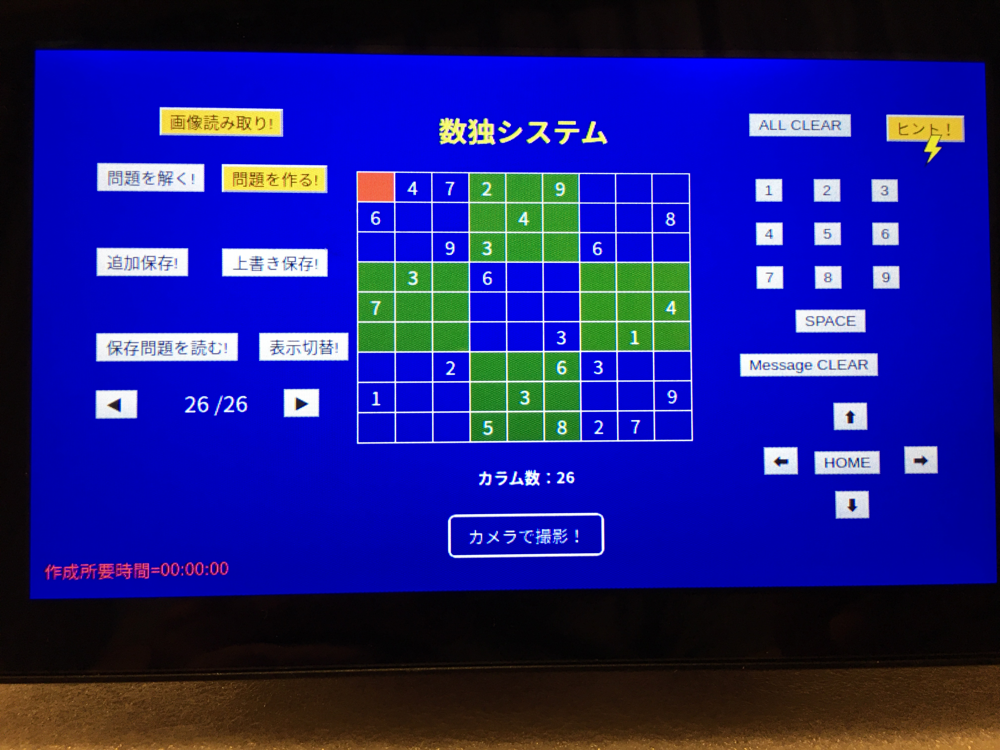

# 数独システムの使い方

##  1. メイン画面

### (1) 画面中央
   a. 数独問題表示画面  
      9X9=81個のマスを表示  
      赤いマスは現在のポインタの位置を示します  
   b. [カメラで撮影!]ボタン  
      撮影画面に移行します

### (2) 画面右側
   a. [ALL CLEAR]ボタン  
      マスに表示されている内容を全てクリアします  
   b. [1]~[9]ボタン  
      ポインタ位置のマスに数字を入力します  
   c. [SPACE]ボタン  
      ポインタ位置のマスの数字を消します  
   d. [Message CLEAR]ボタン  
      画面左下に赤字で表示されるメッセージを消します  
   e. [HOME]と４つの矢印  
      ポインタ（赤いマス）の位置を移動します

### (3) 画面左側
   a. [画像読み取り!]ボタン  
      撮影した数独問題画像を読み取ってデジタル化しマスに表示します  
   b. [問題を解く!]ボタン  
      マスに表示されている問題を解いて答えを表示します  
   c. [問題を作る!]ボタン  
      数独問題を自動作成し、マスに表示します  
   d. [問題を保存!]ボタン  
      マスに表示されている数独問題を保存します
      電源を切っても現在マスに表示されている内容だけは保持されます  
   e. [問題を読む!]ボタン  
      ボタンの下に表示されている番号の問題を読み出してマスに表示します  
      最初にマスに表示されていた内容は保存しておかないと消えます  
   f. [⬅<-],[->]ボタン  
      保存された問題を読み出す時の番号を指定します  
   g. f.のボタンの間にあるa/b 表示  
      a=読み出したい問題の番号  
      b=保存した問題のトータル数  
   h. メッセージ（赤字で表示）  
      各作業の結果をメッセージとして表示します

# 2. 数独問題撮影画面 

(1) 撮影画面  
    カメラのファインダー画像が表示されます  
(2) [シャッターを押す!]ボタン  
    画像をメモリーに取り込み、メイン画面（7.1）に戻ります

# 3. ヒント画面  

(1) ヒント画面

   9X9X9=729個のマス。意味は別途。

(2) ヒントボタン（ヒントの詳細は別途）

a. [単独不確定]ボタン　　単独不確定可能なノードを黄色で表示します  
b. [座席予約]ボタン　　　座席予約されているコアノードを黄色で示します  
c. コア数N　　　　　　　f~jのヒントを出すためのコアマトリクス数を指定します  
d. [<]と[>]ボタン　　　　Cの数を変更します。最大値は６、最低値は２です  
e. [隠れ]ボタン　　　　　N国同盟の場合、出すヒントが”隠れ”なのか通常なのか指定します  
f. [N国同盟(行)]ボタン　　N国同盟のコアノードで、行方向にマスクがかかる場合を表示します  
g. [N国同盟(列)]ボタン　　N国同盟のコアノードで、列方向にマスクがかかる場合を表示します  
h. [N国同盟(blk)]ボタン　N国同盟のコアノードで、ブロック方向にマスクがかかる場合を表示します  
i. [NXN(行)]ボタン　　　四辺形の定理のコアノードで、行方向にマスクがかかる場合を表示します  
j. [NXN(列)]ボタン　　　四辺形の定理のコアノードで、列方向にマスクがかかる場合を表示します  
k. [強ループ]ボタン　　　強弱リンクのループが成立した場合、ターゲットノードがTrueの場合のループを構成するノードを表示します  
l. [弱ループ]ボタン　　　　強弱リンクのループが成立した場合、ターゲットノードがFalseの場合ループを構成するノードを表示します  
  <XYX-WINGなどの解法はk,jに含まれます>  
m. [ヒントクリア]ボタン　　黄色のヒント表示を全てクリアします  
n. [元に戻る!]ボタン　　　　メイン画面(7.1)に戻ります