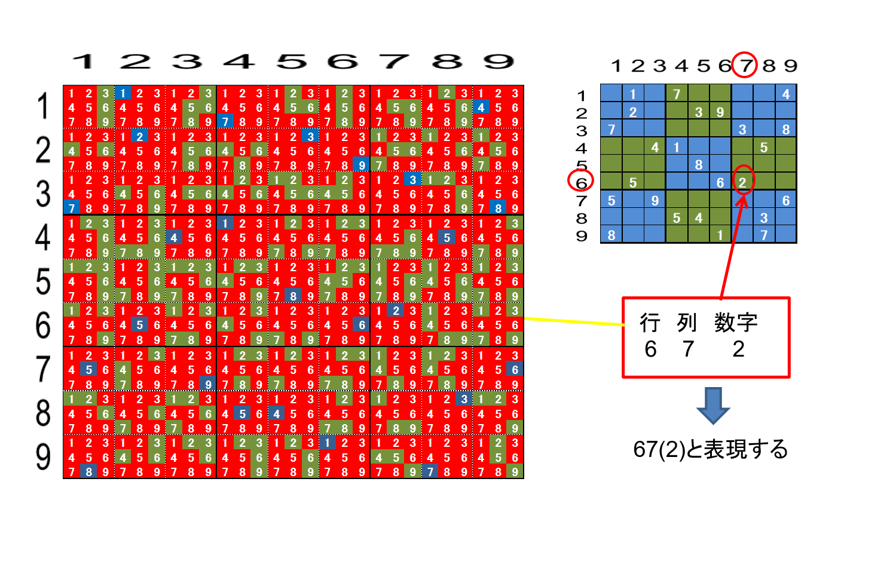
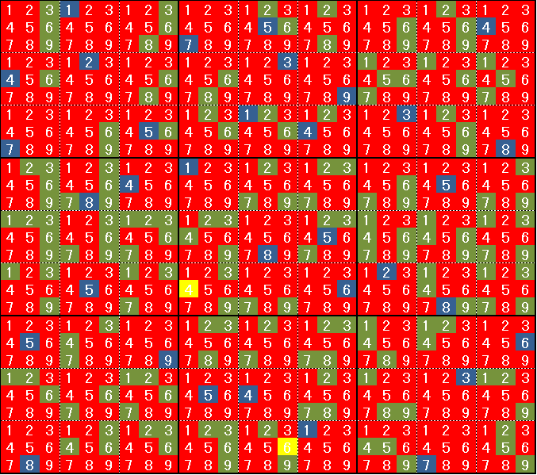

## 数独システムの使い方　その２

### 1. 基本画面とヒント画面の関係
数独システムのヒント画面は三次元キューブでのコアノード情報を二次元に置き換えたものになっています。  
Fig.I-1 数独問題画面
  
Fig.I-1のような問題はありませんが、わかりやすくするために、このように数字が入るとすると、Fig.I-2のようなヒント画面になります。

Fig.I-2 Fig.I-1のヒント画面  
 
三次元情報を二次元で表現しているのでわかりにくいですが、数独問題の9×9のマスの一つ一つに3×3=9個のノードが表現されています。青のノードは”真”のノードを表しています。  
Fig.I-1で左上の画面の数字は”1”ですから、Fig.I-2では左上の9個のマスのうち、”1”が青になっているわけです。２～９まで同様であることを確認してください。  ”9”は画面からはずれていて見えませんが、実際の画面ではスクロールして見ることができます。  
赤のノードはマスクがかかっている”偽”のノードです。”真”のノードによって連動する３つのピアのすべてのノードが赤になっています。
背景色（緑）のままのノードはまだ”真”か”偽“か不確定ということです。数独の問題のヒントはすべてこの緑の不確定ノードの配置から導き出されます。

### 2. ノードの位置の表し方

まず各マス（ノード）の位置を表現する方法を定義します。このテキストでは下記のように定義することにします。

Fig.J 各マスの位置の表現  
 

### 3. ヒント画面の使い方

Fig.Jの問題を例に説明します。まず基本画面で右側の数独問題を入力してください。  
入力したら[問題を保存する!]を押して保存しておいてください。保存した番号が表示されますので覚えておいてください。途中行き詰まったら番号を選んで[問題を読む!]を押せば最初からやり直すことができます。  
数独の上級者ならFig.Jの情報から最後まで解き進めることは出来ますが、初心者の方のために、ここではヒント画面を使いながら説明します。ただし自分で解くのが数独の醍醐味ですから、以下のヒントはあくまで自分で解を見つけてから確認のために使ってください。

### step1 単独不確定ノードを見つける  
ヒント画面で[単独不確定]のボタンを押してください。すると、ボタンが赤くなって
Fig.K-1のような画面が表示されるはずです。

Fig.K-1 単独不確定ノードのヒント画面(1)
 

次の４つのノードが黄色で表示されるはずです。
21(4) 35(1) 42(8) 56(5) 

基本画面に戻って上の４つの数字を入力後、またヒント画面に戻ってください。  
Fig.K-2 のようなヒント画面に変わっているはずです。[単独不確定]ボタンが白くなっていたらもう一度押して赤くしてください。

Fig.K-2 単独不確定ノードのヒント画面(2)  

今度は次の４つのノードが黄色で表示されるはずです。  
15(5) 33(5) 36(4) 68(8)  
これはFig.K-1の単独不確定ノードを”真”に確定することによって、新たに”単独不確定”になったノードです。  
基本画面に戻って上の４つの数字を入力後、またヒント画面に戻ってください。  
Fig.K-3 のようなヒント画面に変わっているはずです。[単独不確定]ボタンが白くなっていたらもう一度押して赤くしてください。  

Fig.K-3 単独不確定ノードのヒント画面(3)  

今度は次の２つのノードが黄色で表示されるはずです。
64(4) 95(6)

同様に基本画面に戻って上の２つの数字を入力後、またヒント画面に戻ってください。  
Fig.K-4 のようなヒント画面に変わっているはずです。[単独不確定]ボタンが白くなっていたらもう一度押して赤くしてください。

Fig.K-4 単独不確定ノードのヒント画面(4)

今度は次の1つのノードだけが黄色で表示されるはずです。  
94(9)

また基本画面に戻って上の数字を入力後、またヒント画面に戻ってください。  
Fig.K-5のように今度は[単独不確定]ボタンを押してもヒントは表示されません。
現段階では単独不確定ノードは存在しないということです。

Fig.K-5 単独不確定ノードのヒント画面(5)

### step2 座席予約によるマスクノードを見つける

Step-1が終わった状態のヒント画面で[座席予約]のボタンを押してください。すると、ボタンが赤くなってFig.L-1のような画面が表示されるはずです。
座席予約によるコアノードによって下記のマスクノードが確定します。

Fig.L-1 座席予約のヒント画面(1)

＊座席予約によるコアノード　　＊コアノードによるマスクノード
　18(2)  38(2)　　　　　　　　　　78(2)  
　74(3)  76(3)　　　　　　　　　　72(3)  
　92(3)  93(3)　　　　　　　　　　				72(3)  
　77(1)  78(1)　　　　　　　　　　87(1)  89(1)  
　81(1)  83(1)　　　　　　　　　　87(1)  89(1)  
　89(2)  99(2)　　　　　　　　　　78(2)

ダブっているマスクもあるので、結局下記４つのノードがマスク確定します。  
87(1)  89(1)  78(2)  72(3)

ここで[ヒント適用]ボタンを押すとマスクされるノード（ブルー）は赤くなり、コアノードの黄色だけが残ります。  
ここでもう一度[座席予約]のボタンを押すとFig.L-2のように別の座席予約ノードが現れてきます。

Fig.L-2 座席予約のヒント画面(2)

＊座席予約によるコアノード　　　　＊コアノードによるマスクノード  
　74(2)  75(2)  76(2)　　　　　　　　　86(2)

ここで[ヒント適用]を押してブルーのマスクノードを赤にしてから[座席予約]ボタンをおしても何も表示されませんので、これで座席予約は無くなったということです。

＜注意！！＞
ここで基本画面に戻るとマスク情報がリセットされてしまいますので、基本画面には戻らないでください。

### step3 二国同盟によるマスクノードを見つける

step2が終わった状態で[N国同盟]ボタンを押すと、Fig.-Mのような二国同盟のコアとブルーのマスクノードが表示されます。

Fig.M二国同盟によるマスクノード

＊二国同盟によるコアノード　　　　＊コアノードによるマスクノード  
　23(6)  23(8)  24(6)  24(8)　　　　　　27(6)  28(6)

ここで[ヒント適用]を押し、[N国同盟]を押してもヒントは何も表示されなくなります。
N国同盟はなくなったということです。  
### step4 再び単独未確定ノードを探す
Step-3が終わった状態で[単独未確定]ボタンを押すと、Fig.Nのような画面が表示されます。28(1) が単独未確定になっていることを確認してください。

Fig.N 単独未確定のヒント画面

この単独未確定ノードが発生したかどうかの確認はいつやってもかまいませんが、
このように単独未確定ノードが発生するまでは基本画面に戻らないでください。
今後は下記のようにドミノ式に単独未確定ノードが次々に現れて最後まで到達できます。
最初の数独システムのヒント画面の使い方を参考に解答を進めてください。

ドミノ回数　　単独未確定ノード  
　　1　　　　　28(1)  
　　2　　　　　77(1)  
　　3　　　　　87(8)  
　　4　　　　　89(9)  
　　5　　　　　99(2)  
　　6　　　　　29(5)  78(4)  93(3)  97(5)  
　　7　　　　　11(3)  27(7)  52(3)  57(4)  72(7)  92(4)  
　　8　　　　　32(9)  46(3)  54(2)  69(3)  74(3)  75(2)  82(6)  86(7)  
　　9　　　　　16(2)  24(8)  34(6)  38(2)  41(2)  49(7)  59(1)  76(8)  83(2)  
　　10　　　　　13(8)  23(6)  45(9)  47(6)  51(6)  53(7)  63(1)  65(7)  81(1)  
　　11　　　　　17(9)  18(6)  58(9)  61(9)

以上のように一つの解法のコアノードによるマスクだけでは単独未確定ノードが発見できない場合があり、複数の解法のドミノ倒しが必要な場合があります。
ただ新聞や雑誌に掲載されている問題は単独未確定を探していけば解ける問題がほとんどです。座席予約や二国同盟が必要な場合もありますが、上級者向けの雑誌に限られます。
でも数独システムを活用していただければ９９％の問題は解けるはずです。  

### 4. 強リンクと弱リンクのヒント画面  

例題には出てきませんでしたが、強リンクや弱リンクの登場する問題もまれに存在します。このシステムにもヒント画面は用意しましたが、ターゲットノードは表示しないようになっています。ターゲットノードを表示するということは、答えを表示することになってしまうからです。リンクしているノードが表示されますので、そのどれかがターゲットノードです。algorythm.mdを参考にしながらターゲットノードを探してみてください。  

以上

