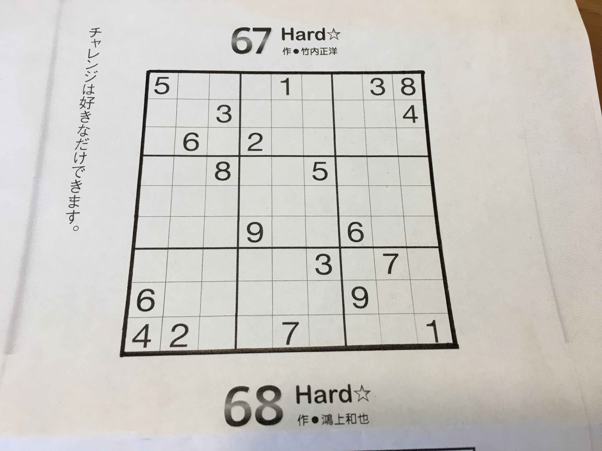
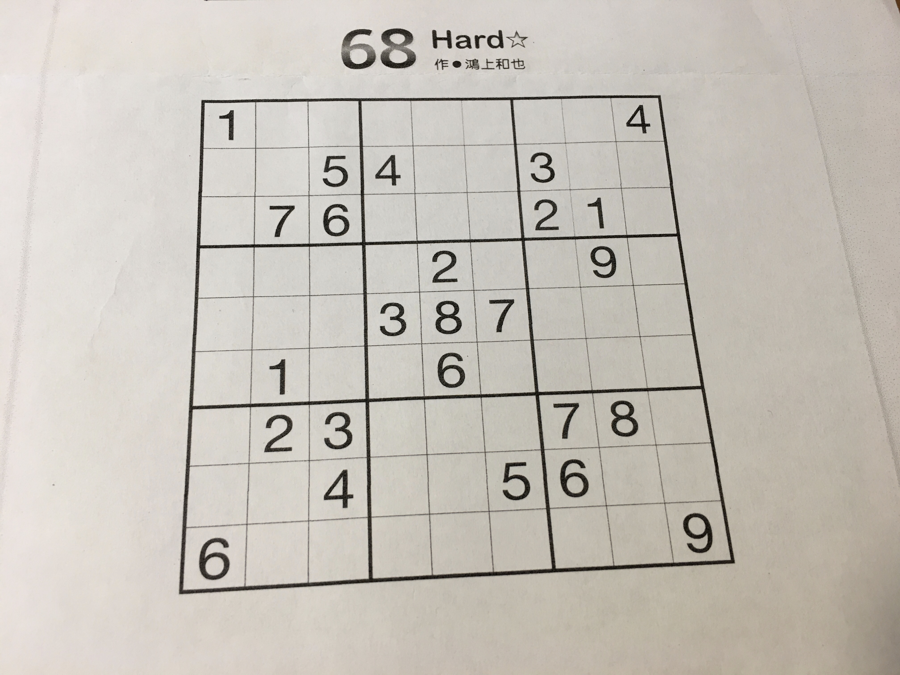

## 数独システムの使い方　その３

### 1. カメラによる数独問題の撮影条件
カメラで読み取った数独問題の処理手順は下記の通りです。  
(1) 数独問題画像の外枠を検出する
(2) 枠が歪んでいたら長方形になるよう全体を補正する（トリムする）。
(3) 全ての枠線を消す  
(4) 枠内を9X9=81個の画像に分割する。  
(5) 一個ずつOCRにかける

外枠が検出できることが大前提なので、撮影条件は下記のようになります。  
(1) 外枠の線が内側のマスの線に比べて濃く太いこと。
(2) 数独システムの影が画像に映らないこと。  
(3) 模様のない白い背景で撮影すること。  

新聞や本の数独問題を撮影するときは上記条件を満たして直接撮影するんもは難しいので、私はまずコピーし、外枠が薄いときはマジックでなぞって濃くしています。多少余計な情報（Fig.3-1で言うと問題番号などの外枠外の情報）が映っていても無視されます。

Fig.3-1 数独問題画像ーよい例
  
数独システムの影が映らないように斜めから撮影していますが、数独システムが補正しますので問題ありません。

Fig.3-2 数独問題画像ー悪い例  
 
きれいに撮れているようですが、外枠の太さが内側の線と同じなのでNGとなります。  

